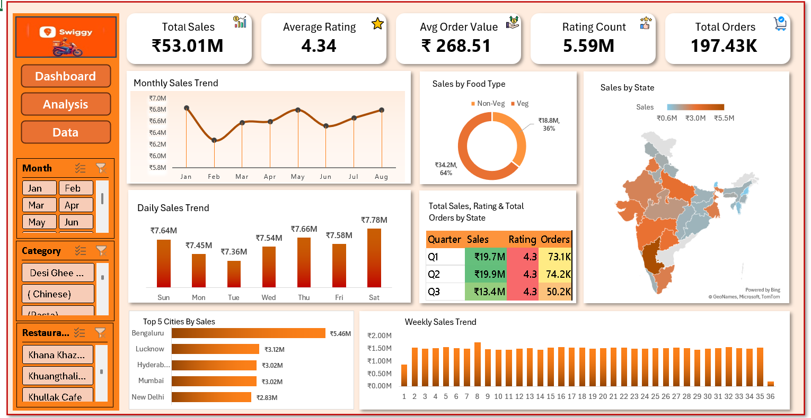

# Swiggy-Sales-Performance-Analytics-Dashboard
Interactive Swiggy Sales &amp; Performance Dashboard built using Microsoft Excel.
# 🛵 Swiggy Sales & Performance Analytics Dashboard (Excel)

An interactive, end-to-end sales analytics dashboard built using Microsoft Excel to analyze Swiggy's revenue performance, customer order patterns, and city/state distributions.

---

## 📊 Dashboard Preview

---

## 📌 Business Problem & Objectives
The goal of this project is to analyze customer order trends, identify revenue-driving categories, track customer satisfaction across restaurants, and visualize state/city performance to aid strategic operational decisions.

---

## 🔑 Key Performance Indicators (KPIs)
- **Total Sales:** ₹53.01M overall revenue generated from food orders
- **Average Rating:** 4.34 customer satisfaction level across restaurants
- **Average Order Value (AOV):** ₹268.51 average spend per order
- **Total Rating Count:** 5.59M reviews recorded
- **Total Orders:** 197.43K completed deliveries

---

## 📈 Visualizations & Insights
1. **Monthly Sales Trend:** Displays monthly fluctuations and seasonality across the year.
2. **Daily Sales Trend:** Compares sales and order variations across weekdays and weekends.
3. **Sales by Food Type (Veg vs Non-Veg):** Revenue breakdown showing Veg (64%) vs Non-Veg (36%) sales contribution.
4. **Sales by State (Map Visualization):** Geographic distribution showing market penetration across Indian states.
5. **Top 5 Cities by Sales:** Identifies primary revenue contributors (Bengaluru, Lucknow, Hyderabad, Mumbai, New Delhi).
6. **Quarterly Performance Summary:** Combined view evaluating quarterly Sales, Ratings, and Order volumes (Q1–Q3).
7. **Weekly Trend Analysis:** Tracks weekly consistency and momentum from Week 1 to 36.

---

## 🛠️ Tools & Skills
- **Microsoft Excel:** Pivot Tables, Advanced Nested Formulas (`IF`, `OR`, `ISNUMBER`, `SEARCH`), Conditional Formatting
- **Data Visualizations:** Doughnut Chart, Geographic Map Chart, Clustered Bar/Column Charts, Trend Lines
- **Interactivity:** Custom Slicers (Month, Category, Restaurant Name) for real-time dynamic filtering
